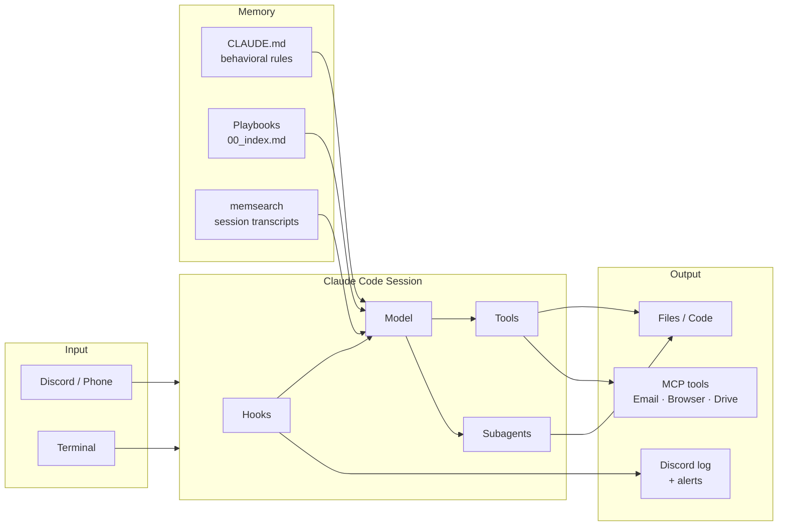

# claude-personal-os — Web Pages Draft

*Draft 2026-05-13 rev 3.*

---

## Hero Visual (top of page, before any prose)

The first thing a visitor sees. Two options — recommend going with both: Ideogram illustration as the background/hero image, Mermaid system diagram immediately below it as the "how it works" anchor.

### Ideogram prompt (hero illustration)

> Isometric technical blueprint of a personal AI workstation. Center: compact desktop computer with glowing session activity. Radiating outward: structured data flows to a mobile phone (Discord), to a memory vault (layered filing system), to a browser, to a calendar/email icon. Dark charcoal background, single cyan accent color on the data flows. Circuit-trace aesthetic, no humans, no logos, no gradients. Engineering schematic style. High contrast.

### Mermaid system diagram (inline SVG, below hero image)

Shows the whole system at a glance — what connects to what, where memory lives, how Discord fits in. Should be readable in 10 seconds.



---

## Page 1 — What This Is

A personal configuration layer for Claude Code: the rules, automation, and connective tissue that run under every session. Not a framework, not a product. A dotfiles repo where the interesting parts are the behavioral constraints rather than the utilities.

What makes this config worth looking at: it's the result of real use over time, not a designed showcase. The hook errata section exists because those things broke in production. The playbook library (~150 entries) exists because the same problems kept coming back.

The system started with a companion multi-agent platform (OpenClaw) handling autonomous background tasks — named agents running on different models, Discord-connected, scheduled. That layer is still running but largely idle for now. Claude Code's built-in capabilities — hooks, MCP, native multi-agent dispatch — have grown to cover most of what I needed from it, and cron jobs handle the rest. The story of how that happened is in the billing section.

---

## Page 2 — Architecture

### Hook Lifecycle

Claude Code exposes hook points that fire shell scripts with structured JSON on stdin. This config uses four:

| Hook | When it fires | What this config uses it for |
|---|---|---|
| `PreToolUse` | Before any tool call | (1) Block writes to protected paths; (2) flush narrative text to Discord before the tool runs |
| `PostToolUse` | After any tool call | Post per-tool summary line to Discord log channel |
| `Stop` | When a response ends | Safety net: check if a Discord message arrived without a reply |
| `PostCompact` | After context compression | Re-inject critical context that would otherwise be lost |

Two non-obvious behaviors that aren't documented clearly:

**Exit codes are asymmetric.** `exit 2` blocks the tool call and surfaces your stderr message to the model. `exit 1` does not block — it's treated as a non-blocking failure. If you're enforcing a constraint, it must be `exit 2`.

**Hook matchers cover tool names, not file operations.** A matcher of `Write|Edit` won't catch `Bash` calls that write files (`cp`, `tee`, `>>`). The `protect-sensitive-files.sh` hook includes `Bash` in its matcher and inspects the command string.

```
[Session Start]
    → SessionStart hook: inject memory context, check system state

[Each Turn]
    → User input
    → PreToolUse hook:
        ├── Block? (exit 2 → model sees stderr, tool is not called)
        └── Allow? → flush narrative text to Discord (backgrounded, <1ms latency)
    → Tool executes
    → PostToolUse hook → post tool summary line to Discord log

[Notification (approval needed)]
    → @mention in conversation channel (bot API)
    → alert to #alerts webhook

[Context Compression]
    → PostCompact hook: re-inject behavioral rules, active context
```

*(Mermaid diagram: hook lifecycle with decision branch on exit code)*

### MCP Integration

Claude Code supports MCP natively. This config runs:

- **Discord MCP plugin** — Claude Code reads and replies to Discord channels directly. The same Discord server also receives hook-streamed session output.
- **Playwright MCP** — Browser automation inside Claude Code sessions. Runs on a node@22 wrapper due to a simdjson mismatch with the system node.
- **Google Workspace** — Email, Calendar, Drive, Sheets via the `gog` CLI. Not MCP, but used the same way: available in any session, no separate setup.

The memsearch plugin (v0.4.2) runs local vector embeddings via ONNX and stores session transcripts in a per-project Milvus SQLite database. Semantic search against prior sessions is available at session start.

### Multi-Agent Architecture

Named agent types are defined as `.md` files in `~/.claude/agents/`. Each specifies a model, description, and behavioral persona. The Agent tool dispatches to them by `subagent_type`.

| Agent | Model | Role |
|---|---|---|
| Cob | Sonnet | Implementation — files, shell, code |
| Claudio | Sonnet | Top-level Sonnet instance (this session); also used as isolated reasoning/analysis context |
| Gadfly | Sonnet | Adversarial product reviewer |
| CTO | Sonnet | Technical planning reviewer |
| The Architect | Opus | Structural code/architecture reviewer |
| Safety Officer | Opus | Hardware safety review |
| Seymour | Haiku | General tasks, research, ops |
| Digger | Haiku | Read-only codebase search |

Sequencing rule: **Gadfly before CTO**. If CTO runs first, its plan anchors everything; Gadfly's product objections come too late to change the structure. Run Gadfly first, then CTO with Gadfly's findings as input.

Agent identities persist via their config files — the same way OpenClaw's SOUL.md approach works, applied per-agent rather than globally.

*(Mermaid diagram: orchestrator → subagent fan-out with model tiers)*

---

## Page 3 — Memory System

Three layers, different timescales.

### Layer 1: CLAUDE.md — Behavioral Rules

Loaded at every session start. Sets the working model, tool permissions, behavioral constraints, and session expectations — the context that should be true every time without having to re-establish it.

There are three CLAUDE.md files in this setup: user-level (`~/.claude/CLAUDE.md`), project-level (per repo), and workspace-level. Claude Code merges them, with project files taking precedence. The user-level file is the one published here.

What goes in CLAUDE.md: things that need to be true on every session, regardless of what was discussed last time. Communication style. Tool permission policy. Protected paths. Session-start behavior. Key architectural facts. The lessons-learned section.

What doesn't go in CLAUDE.md: anything that changes frequently, project-specific operational detail, or anything that belongs in a playbook.

### Layer 2: Playbooks — Operational Knowledge

Playbooks are the long-term memory of the system. Each one records a specific thing that broke, or a pattern that worked, or a behavioral constraint that emerged from real use.

Format: what happened, why it happened, and how to apply the lesson going forward. Indexed by keyword in `memory/00_index.md`. When a task matches a topic, the relevant playbook is read before responding — not because Claude "remembers" it, but because the index points there.

The full library covers: agent behavior, specialized software tooling across projects, Claude Code/API quirks, hardware interfaces, macOS, build/CI patterns, safety and protocol, and LLM product patterns.

`selected-playbooks/` in this repo contains a representative subset with no personal information or customer-specific context. Selection criteria: broadly reusable technical gotchas that transfer to any similar setup.

A playbook gets written when:
- Something broke and the root cause wasn't obvious
- A workaround was required that a reader wouldn't discover naturally
- A behavioral constraint emerged that doesn't appear in any docs

### Layer 3: Auto-Memory — Session Continuity

The memsearch plugin (installed 2026-05-09) captures session transcripts automatically and indexes them via local ONNX embeddings (bge-m3, ~558 MB, runs entirely on-device). Per-project isolation — each git root gets its own `.memsearch/` collection. Semantic search against prior sessions is injected as hints at session start.

Separately, structured memory files (`memory/*.md`) record decisions, project state, and non-obvious facts that need to survive across sessions. A `MEMORY.md` index (200-line limit, one-line entries per file) makes retrieval fast without loading everything into context.

The design intent: Claude Code should be able to answer "what did we decide about X" or "why did we do Y" from memory — not from re-reading the transcript.

*(Mermaid diagram: three-layer memory with input/output flows)*

---

## Page 4 — Discord Integration

Discord is the primary interface for Claude Code sessions — including when sitting at the same machine. Terminal is open for fallback; Discord is where work actually happens.

The hook (`discord-notify.sh`) is a PreToolUse + PostToolUse + Notification hook. It has four paths:

**PreToolUse (narrative text):** Before each tool call, the hook extracts any new text blocks from the session JSONL and posts them to the configured Discord log channel. This fires before the tool runs, so updates arrive in Discord with minimal latency — not after a potentially slow tool call completes.

**PostToolUse (tool summaries):** After each tool call, a one-line summary posts to the log channel: `**Edit** \`filename\``, `**Bash** \`command\` → N lines`, `**Agent** description`, etc. Tool calls are readable in Discord as they happen.

**Notification (approval alerts):** When Claude Code needs approval for a sensitive operation, the hook:
- Posts an @mention directly to the conversation channel via bot API (the channel where the user is)
- Posts to a dedicated `#alerts` webhook
- Posts to the per-session log webhook

**Per-session channel routing:** Sessions started from different project directories are bound to different Discord channels. The hook reads session state files to determine which log webhook to use, so each project's output flows to its own channel rather than a shared log.

The result: a session running on a Mac Mini is fully observable from a phone. Narrative text arrives before tool calls; tool summaries arrive after. Approvals generate @mentions. No terminal needed to know what's happening.

Hardware: Termius for mobile terminal access when needed. Ghostty for desktop terminal (same machine or remote). In practice, Discord handles almost all interaction.

*(Ideogram prompt: illustration of async session monitoring — terminal sending structured packets to phone, abstract/technical)*

---

## Page 5 — Patterns and Commands

### review-sequence

Adversarial review, in the correct order.

The sequencing matters: Gadfly runs before CTO. If CTO runs first, it produces a plan that anchors subsequent review. Gadfly's product objections — which often reveal wrong assumptions about what users want — come too late to change the structure. Run Gadfly first, then CTO with Gadfly's findings as context.

The four reviewers and when to use each:

| Reviewer | Model | Focus |
|---|---|---|
| Critic | Sonnet | Pre-commit code review — harsh, specific, no suggestions |
| Gadfly | Sonnet | Product skeptic — wrong assumptions, user pain, what makes users quit |
| CTO | Sonnet | Technical planning — build sequence, architectural coherence, what to defer |
| The Architect | Opus | Structural review — logic correctness, edge cases, design trade-offs |

Not every task needs all four. A bug fix needs Critic, not Gadfly. A new feature spec needs Gadfly before CTO. An architectural decision needs The Architect.

### batchc

Parallel subagent dispatch with wave sizing and merge enforcement.

The pattern: identify independent tasks, determine wave size based on context budget, dispatch in parallel, merge before the next wave. The "merge before parallelize" rule prevents downstream agents from working on stale or contradictory intermediate state.

Wave sizing is explicit, not inferred. Three waves of three agents each is different from nine agents at once — both in rate limit exposure and in context coherence at merge.

The command also enforces: don't dispatch a consumer before its dependency. If Agent B needs Agent A's output, they don't run in the same wave.

### session-handoff

Structured resumption document, written at the end of a session.

Covers: what was accomplished, what's in progress, what's blocked, what the next session should start with. Stored in `workspace/HANDOFF.md`. The next session reads it, not the transcript.

A well-written one-page handoff is worth more for continuity than the raw conversation history. The transcript has everything but requires synthesis at read time. The handoff has the synthesis already done.

---

## Page 6 — The Sync Pipeline

The public repo is auto-synced from `~/.claude` on a nightly cron. The sync script (`sync-to-public.sh`) is in the repo.

Steps:

1. Pull latest from remote
2. Wipe working directory (preserve `.git`)
3. `rsync` from `~/.claude`, excluding: sessions, memory, credentials, caches, agent data
4. Redaction pass — personal identifiers and secret tokens replaced mechanically
5. Copy selected playbooks from workspace memory library (explicit allowlist, no grep heuristics)
6. Commit and force-push if there are changes

Design priorities: the repo stays current automatically, sanitization is mechanical rather than manual, there's nothing to remember to export.

**Fail-closed trap:** Any unexpected non-zero exit hits a `fail()` function that logs the error and appends to an alert file before exiting. The trap is explicitly disarmed on clean exit so it doesn't fire twice.

**Explicit allowlist for playbooks:** The playbook export is named, not grep-based. Nothing gets published by accident because it happened to not match a heuristic.

The exclude list (`claude-public-exclude.txt`) is also in the repo.

---

## Page 7 — OpenClaw and Why Claude Code Became the Primary System

OpenClaw is a self-hosted multi-agent platform that gained traction by letting users wire Claude into their messaging apps — Discord, Telegram, iMessage — and run named agents autonomously on a schedule. The architecture is genuinely good: a gateway process, per-agent sessions, a community marketplace of skills (ClawHub), and a SOUL.md system for persistent agent identity. For a while it was the most practical way to run Claude beyond the chat interface.

I ran it seriously for several months. Multiple agents running simultaneously, Discord-connected, handling email triage, research tasks, iMessage relay. The setup worked.

**What changed:** Claude Code's built-in capabilities have grown to cover most of what I used OpenClaw for. Native multi-agent dispatch (Agent Teams), git worktrees for isolation, MCP natively supported, hooks for automation and messaging. And Discord integration turns out to be achievable directly in Claude Code — hooks stream every session to Discord, and the MCP plugin handles inbound. I don't need a separate gateway for that.

The other factor was billing. OpenClaw previously routed through Claude Pro subscription tokens — $20/month effectively. Anthropic closed that on April 4, 2026. OpenClaw with Claude now requires direct API keys at per-token rates. For my actual workload, staying inside Claude Pro's subscription with Claude Code makes more sense than paying API rates for OpenClaw.

For now, my automation needs are met by cron jobs running directly. OpenClaw is still running — I expect to use it more actively again when I'm doing marketing and sales automation for products I'm developing, where the scheduled background agent model fits better. But for daily development work, Claude Code alone handles it.

**What OpenClaw still does better:**
- ClawHub marketplace: 13,000+ community skills. Long-tail integrations (smart home, sport booking, niche CRMs) that would take real build time in Claude Code.
- iMessage and Signal connectors: not in the official Claude ecosystem.
- The scheduled autonomous agent model for tasks that run without a human in the loop.

**Cost comparison:**

| Setup | Monthly cost | Notes |
|---|---|---|
| Claude Code Pro | $17 (annual) | Subscription quota covers agent workloads |
| OpenClaw + Claude API | $50–200+ | Per-token at API rates. Heavy users: $500+ |
| OpenClaw + local models | ~$20 server costs | Trades model quality for cost |

---

## Page 8 — How to Use This Config

This repo is a reading resource and a parts library, not a plug-and-play install.

**Start here:**
- `CLAUDE.md` — the behavioral contract. Read it to understand what's expected at session start and why.
- `LESSONS.md` — the hard-won knowledge. Read it before you hit the gotchas yourself.
- `hooks/README.md` — if you want Discord integration or file protection.

**Pick what you need:**

*For file protection:* `hooks/protect-sensitive-files.sh`. Adjust the path list to match your protected files. The hook matcher must include `Bash` — not just `Write|Edit`.

*For Discord monitoring:* `hooks/discord-notify.sh` + `discord-text-extract.py`. Requires a Discord bot token and configured webhooks. See the hook README for setup.

*For adversarial review:* `commands/review-sequence.md`. The sequencing rule (Gadfly before CTO) is the critical part — copy that into your own CLAUDE.md.

*For playbooks:* `selected-playbooks/` contains the subset with no personal context. Read them as examples of the format. The value is in writing your own, not in the specific content here.

**The config that requires OpenClaw:**

Several skills in this repo reference the companion system. They're included as examples of the delegation pattern, not portable tools. If you don't have OpenClaw running, skip `skills/` entries that reference `sessions_spawn` or agent IDs.

**What to keep in CLAUDE.md:**

The test: does this need to be true on every session, regardless of what was discussed last time? If yes, CLAUDE.md. If it's project-specific, a project-level CLAUDE.md. If it's operational knowledge that changes, a playbook.

---

## Visual Plan

### Mermaid Diagrams (generate inline in HTML)

1. **Hook lifecycle** — flowchart: PreToolUse → decision (block/allow) → tool executes → PostToolUse → Discord log. Separate branch for Notification path. Stop hook as a side branch.
2. **Memory layers** — diagram: CLAUDE.md (always loaded at session start) → playbooks (matched on demand by keyword index) → memsearch (session transcript search) feeding into Claude's active context
3. **Multi-agent fan-out** — orchestrator dispatches to specialist subagents across model tiers (Opus / Sonnet / Haiku), merge step shown

### Ideogram Prompts (for manual generation)

**Hero / overview:**
> Technical blueprint aesthetic, isometric, dark background. A compact desktop computer connected via structured data flows to a mobile phone. Session activity represented as circuit traces or network packets. Clean lines, monochrome with single accent color. No people, no faces, no logos. Engineering diagram style.

**Discord integration:**
> Abstract technical illustration: bidirectional structured data flow between a terminal session (left) and a mobile phone (right). Flow passes through labeled stages: narrative extraction, tool summary, alert routing. Geometric, dark background, sparse. No chat bubbles, no Discord logo, no gradients.

**Memory system:**
> Three-tier architectural diagram as physical metaphor. Bottom layer: foundation stone, labeled "rules". Middle layer: indexed filing system, labeled "knowledge". Top layer: active workspace with ephemeral notes, labeled "session". Each layer feeds upward. Isometric, dark, technical. No people.

**Sync pipeline:**
> Data pipeline illustration. Private source on left (padlock), public repository on right (open book). Data passes through a center filter/redaction stage. Plumbing or circuit trace metaphor, not flowchart boxes. Monochrome with accent on filter stage.

### Structure choice (Q4)

Single-page HTML with anchored sections. One URL, per-section deep-links (e.g. `#memory`, `#discord`), simpler to maintain. Memory section anchored at `#memory` per Q1 answer.
